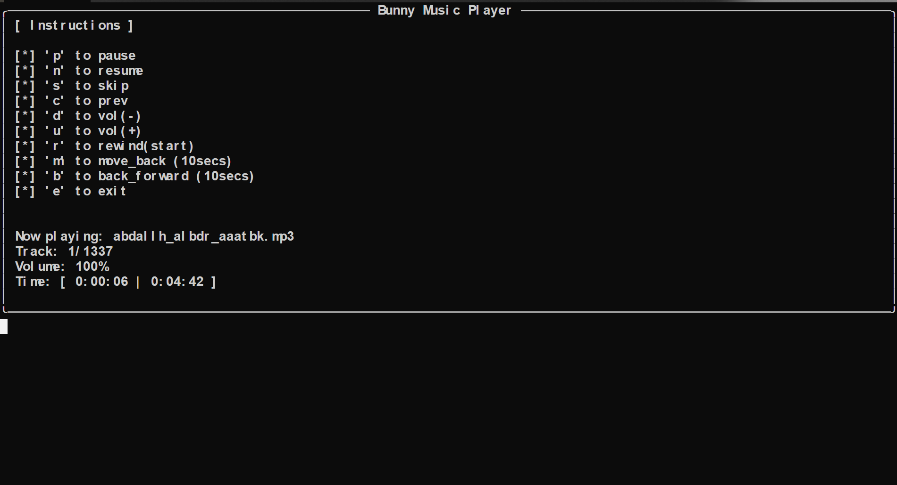

# Bunny Music Player

<p align="center">
  
</p>
<br>

[](https://github.com/officicalalkhaldi/Bunny-Music-Player)

The "Bunny Music Player" is a Python command-line tool for playing music. It offers keyboard shortcuts for playback control, volume adjustment, and track navigation. Users specify a directory for their music files, and the player provides track information and playback instructions.

## Features
Playback Control: Easily control music playback with keyboard shortcuts.
Volume Adjustment: Adjust volume levels conveniently from the command line.
Track Navigation: Navigate through tracks in the playlist with ease.
Playback Information: Get real-time information about the currently playing track, including its title, volume, and playback progress.

## Screenshots

<br>



## Usage

> <sup> Replace <directory_path> with the path to the directory containing your music files. </sup>


```
git clone https://github.com/officicalalkhaldi/Bunny-Music-Player.git

cd Bunny-Music-Player

python music_cli.py --playlist <directory_path>

```
<br>

## Keyboard Shortcuts
```
Keyboard Shortcuts
p: Pause/Resume playback
n: Next track
s: Skip track
c: Previous track
d: Decrease volume
u: Increase volume
r: Rewind to start
m: Move back 10 seconds
b: Move forward 10 seconds
e: Exit the player
```

## Requirements

```
Python 3.x
pip install rich
```


## Contributing

``` 
Pull requests are welcome. For major changes, please open an issue first
to discuss what you would like to change.

Please make sure to update tests as appropriate.
```

## License
[MIT](https://choosealicense.com/licenses/mit/)
